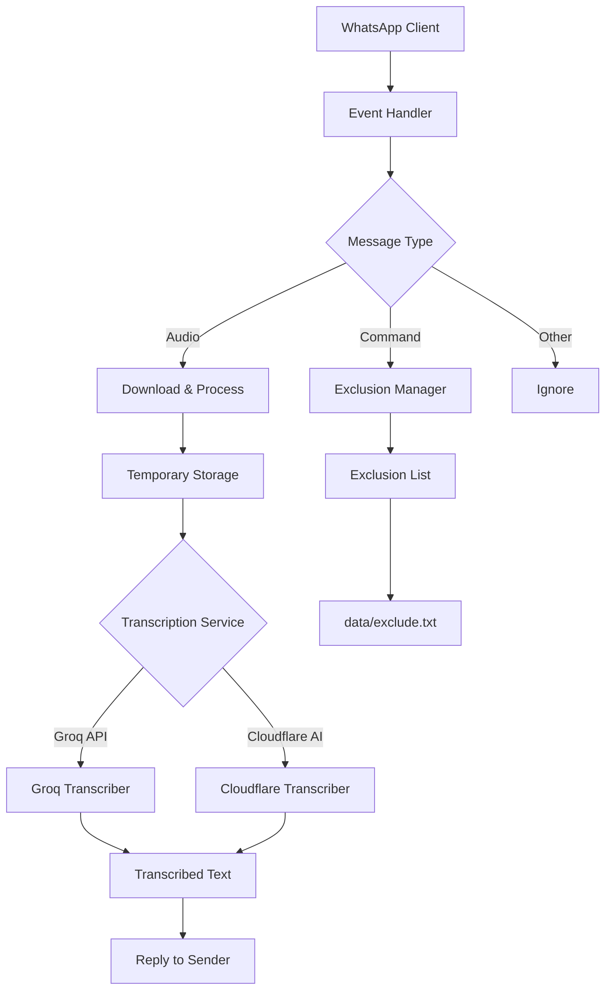

# WhatsApp Audio Transcription Bot

A powerful Go-based WhatsApp bot that automatically transcribes audio messages (voice notes, documents, videos, and images) using advanced AI transcription services. The bot supports multiple transcription providers and includes intelligent exclusion management.

## 🚀 Features

- **Multi-Provider Transcription**: Supports both Groq and Cloudflare AI transcription services
- **Real-time Processing**: Automatically processes incoming audio messages and returns transcriptions
- **Exclusion Management**: Built-in system to exclude specific phone numbers from processing
- **Administrative Commands**: Simple commands to manage the exclusion list
- **Persistent Storage**: SQLite database for session management and exclusion list persistence
- **Flexible Logging**: Optional file logging with console output always available
- **Language Support**: Configurable transcription language (defaults to Portuguese)

## 📋 Prerequisites

- Go 1.23.0 or higher
- WhatsApp account (for QR code authentication)
- API keys from one of the supported transcription services:
  - Groq API key (recommended)
  - OR Cloudflare Account ID and API key

## 🔧 Installation

### 1. Clone the Repository

```bash
git clone <repository-url>
cd whatsapp-transcriber-go
```

### 2. Install Dependencies

```bash
go mod download
```

### 3. Set Up Environment Variables

Create a `.env` file in the project root with the following configuration:

```env
# Transcription Service Configuration (Choose ONE option)

# Option 1: Groq API (Recommended)
GROQ_API_KEY=your_groq_api_key_here

# Option 2: Cloudflare AI
CF_ACCOUNT_ID=your_cloudflare_account_id
CF_API_KEY=your_cloudflare_api_key

# Optional Configuration
TRANSCRIPTION_LANGUAGE=pt  # Language code (defaults to 'pt' for Portuguese)
```

### 4. Build the Application

```bash
go build -o whatsapp-transcriber cmd/bot/main.go
```

## ⚙️ Configuration

### Environment Variables

| Variable | Required | Description | Default |
|----------|----------|-------------|---------|
| `GROQ_API_KEY` | Yes (or Cloudflare) | Your Groq API key for transcription | - |
| `CF_ACCOUNT_ID` | Yes (if using Cloudflare) | Your Cloudflare Account ID | - |
| `CF_API_KEY` | Yes (if using Cloudflare) | Your Cloudflare API key | - |
| `TRANSCRIPTION_LANGUAGE` | No | Language code for transcription | `pt` (Portuguese) |

### Supported Transcription Services

#### Groq API (Recommended)
- **Model**: `whisper-large-v3`
- **API URL**: `https://api.groq.com/openai/v1/audio/transcriptions`
- **Features**: Fast, accurate, cost-effective transcription

#### Cloudflare AI
- **Model**: `@cf/openai/whisper-large-v3-turbo`
- **API URL**: `https://api.cloudflare.com/client/v4/accounts/{account_id}/ai/run/{model}`
- **Features**: Serverless, scalable, integrated with Cloudflare ecosystem

### Exclusion List Management

The bot maintains an exclusion list stored in `data/exclude.txt`. You can manage this list through:

1. **Administrative Commands** (via WhatsApp):
   - `/backend <service>` - Switch transcription backend (groq|cloudflare|deepgram)
   - `/backend` - Show backend switching usage
   - `/exclude <number>` - Add a phone number to exclusion list
   - `/exclude` - Show exclusion list status
   - `/include <number>` - Remove a phone number from exclusion list
   - `/include` - Show inclusion list status

2. **Manual File Editing**: Edit `data/exclude.txt` directly (one number per line)

## 🏃‍♂️ Usage

### 1. Start the Bot

```bash
# Start with console logging only (default)
./whatsapp-transcriber

# Start with both console and file logging
./whatsapp-transcriber --log
```

#### Command Line Options

| Option | Description | Default |
|--------|-------------|---------|
| `--log` | Enable logging to file | `false` |
| `--backend` | Transcription backend to use (groq\|cloudflare) | - |

### 2. Initial Authentication

1. **QR Code Generation**: The bot will generate a QR code and save it as `qrcode.png`
2. **WhatsApp Authentication**: 
   - Open WhatsApp on your mobile device
   - Go to Settings → Linked Devices → Link a Device
   - Scan the QR code displayed in your terminal or from the `qrcode.png` file
   - Confirm the pairing on your mobile device

### 3. Sending Audio Messages

Once authenticated, simply send audio messages (voice notes) to the bot. It will:

1. Receive the audio message
2. Download and process it
3. Send the transcribed text back to you

### 4. Supported Media Types

The bot can transcribe:
- **Audio Messages** (`.ogg` format)
- **Document Messages** (audio files)
- **Video Messages** (audio extraction)
- **Image Messages** (with audio content)

## 📁 Project Structure

```
whatsapp-transcriber-go/
├── cmd/
│   └── bot/
│       └── main.go              # Application entry point
├── internal/
│   ├── exclusion/
│   │   └── exclusion.go         # Exclusion list management
│   └── transcription/
│       ├── transcription.go     # Core transcription logic
│       ├── groq.go              # Groq API implementation
│       └── cloudflare.go        # Cloudflare AI implementation
├── data/
│   └── exclude.txt              # Exclusion list file
├── logs/
│   └── debug.log                # Application logs
├── messages/                    # Temporary audio storage
├── go.mod                       # Go module definition
├── go.sum                       # Go module checksums
├── .env                         # Environment variables
└── README.md                    # This file
```

## 🔧 Architecture



## 🛠️ Development

### Running in Development Mode

```bash
# Run without building
go run cmd/bot/main.go

# Run with verbose logging
go run -v cmd/bot/main.go
```

### Adding New Transcription Services

1. Create a new file in `internal/transcription/`
2. Implement the `Transcriber` interface:
   ```go
   type Transcriber interface {
       TranscribeAudio(ctx context.Context, audioFilePath string, language string) (string, error)
   }
   ```
3. Update the main.go file to include your new service

### Testing

```bash
# Run tests
go test ./...

# Run tests with coverage
go test -cover ./...
```

## 📊 Logging

The application provides flexible logging options:

- **Console Output**: Always available with structured logging and timestamps
- **File Logging**: Optional JSON-formatted logs saved to `logs/debug.log` (use `--log` flag)
- **Log Levels**: Debug, Info, Error, and Fatal levels

### Logging Configuration

#### Console Logging (Default)
- Always enabled
- Provides real-time feedback in the terminal
- Includes all log levels (Debug, Info, Error, Fatal)

#### File Logging (Optional)
- Enable with `--log` command line flag
- Creates `logs/debug.log` with JSON-formatted logs
- Automatically creates the `logs/` directory if it doesn't exist
- Includes full context with timestamps and log levels

### Log File Location
- `logs/debug.log` - Application logs (only when `--log` flag is used)

## 🔒 Security Considerations

- **API Key Storage**: Never commit API keys to version control
- **Session Management**: Session data is stored locally in `data/session.db`
- **Message Processing**: Audio files are processed temporarily and then deleted
- **Access Control**: Use exclusion list to prevent unauthorized processing

## 🐛 Troubleshooting

### Common Issues

1. **QR Code Not Generating**
   - Ensure WhatsApp is updated
   - Check internet connection
   - Try restarting the application

2. **Transcription Failures**
   - Verify API keys are correctly set
   - Check API service status
   - Ensure sufficient API quota/credits

3. **Connection Issues**
   - Check firewall settings
   - Verify WhatsApp account permissions
   - Look for error messages in logs

### Debug Mode

For detailed debugging:

1. **Console Debugging**: Always available with real-time log output
2. **File Debugging**: Enable with `--log` flag to save comprehensive logs to `logs/debug.log`

Check the `logs/debug.log` file (when enabled) for detailed error information and debug traces.

## 📈 Performance Optimization

- **Concurrent Processing**: Audio messages are processed in goroutines
- **Temporary File Management**: Files are automatically cleaned up after processing
- **Connection Pooling**: HTTP clients are reused for API calls
- **Efficient Memory Usage**: Audio files are streamed rather than loaded entirely into memory

## 🤝 Contributing

1. Fork the repository
2. Create a feature branch
3. Make your changes
4. Add tests if applicable
5. Submit a pull request

## 📄 License

This project is licensed under the MIT License. See the LICENSE file for details.

## 🙏 Acknowledgments

- [Whatsmeow](https://github.com/tulir/whatsmeow) - WhatsApp library for Go
- [Groq](https://groq.com/) - Fast AI inference
- [Cloudflare AI](https://cloudflare.com/ai/) - Serverless AI services
- [Zap Logger](https://go.uber.org/zap) - High-performance logging

## 📞 Support

For support and questions:
- Check the troubleshooting section above
- Review console logs for real-time information
- Enable file logging with `--log` flag and check `logs/debug.log` for detailed debugging
- Open an issue in the repository